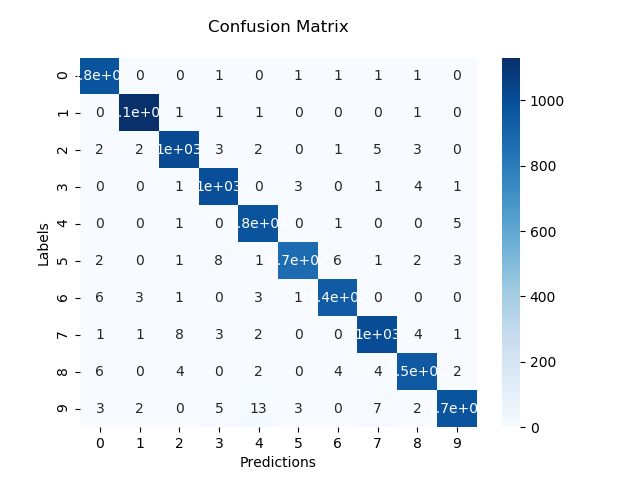

# Mnist-Digit-Recognition-

## About

The main goal of this project is to create a convolutional neural network (CNN) to recognize which handwritten digit is in the image.

### Dataset
For this project the [MNIST dataset](http://yann.lecun.com/exdb/mnist/) was used and the download of the dataset were made by Pytorch framework.

### Implementation
The code was implemented in python using pytorch, scikit-learn, matplotlib and seaborn libraries. The dataset was obtained through `torchvision.datasets.MNIST` and it already has a split train/test defined. The CNN used was very simple, the architecture is compose by 2 consecutives convolutional layers followed by a flatten and a fully-conected layer and a log-softmax is applied to the output tensor, a required operation, since the network is trained using the NllLoss.

### Training
The training of the CNN was perform through 20 epochs using the Adam optimizer with a learning rate of ``` 0.0001 ``` and the objective function was NllLoss. 

### Summary
`Main.py`: file that calls the training and testing of the model based on users choice, prints and plots the model's result.

`Network.py`: file that contains the definition of the model architecture.

`train.py`: file where the training routine is implemented.

`test.py`: file where the testing routine is implemented.

## How To
The python version used in this project was:
```
    Python 3.7.3
```

First you will need to install the following dependencies:
``` 
    pip install torch torchvision torchaudio
    pip install scikit-learn
    pip install seaborn
    pip install matplotlib
```
The command to install pytorch differ according to your setup, check the [docs](https://pytorch.org/get-started/locally/) to see the version that would fit you better

Once the dependencies were installed to run the code go to the root of this repository and execute the command below:
``` 
    python Main.py --epochs <Number_of_epochs>
```
Also, when running the Main.py file, is possible to fit some methods' parameters. To do so choose at least one of the following flags defining the desired value:

`--epochs`: define the number of epochs you want to perform the training. (required)

`--lr`: Choose the learning rate you want to use, default `0.0001`. (optional)

## Results

<div align="center">

</div>
<div align="center">
<h3> Accuracy of 98,4% obtained </h3>
</div>
